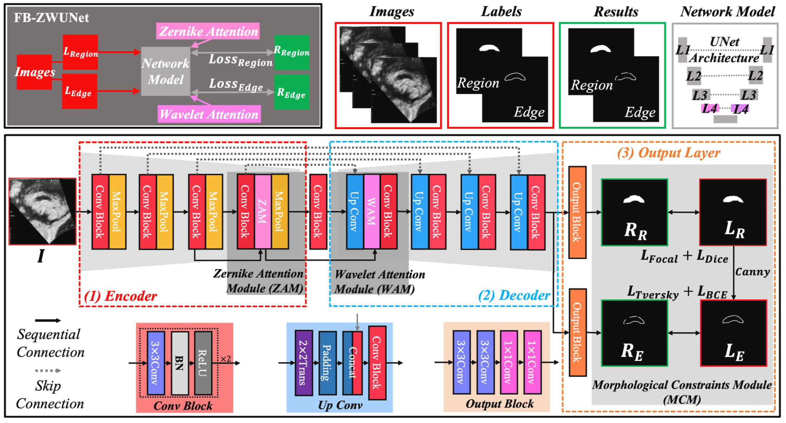

# FB-ZWUNet: Corpus Callosum Segmentation for Prenatal Diagnostics

This repository presents the outcomes of the study:

> **"FB-ZWUNet: A deep learning network for corpus callosum segmentation in fetal brain ultrasound images for prenatal diagnostics"**  
> *Qifeng Wang, Dan Zhao, Hao Ma, Bin Liu*  
> Published in **Biomedical Signal Processing and Control**, 2025.  
> DOI: [10.1016/j.bspc.2025.107499](https://doi.org/10.1016/j.bspc.2025.107499)

---

## Overview
FB-ZWUNet is a specialized deep learning framework for **automated segmentation of the corpus callosum (CC)** in **fetal brain mid-sagittal ultrasound images (FBMS)**, designed to assist **prenatal diagnostics**.



Key components:
- **Zernike Attention Module (ZAM)** – Shape-aware feature extraction.
- **Wavelet Attention Module (WAM)** – Multi-scale feature fusion.
- **Morphological Constraint Module (MCM)** – Edge and region refinement.

The model is trained on the **FB-CC Dataset** (1,336 annotated FBMS images, 18–32 weeks gestation), outperforming state-of-the-art networks in **Dice (0.8743)** and **IoU (0.7813)**, while maintaining fast inference (135ms).

---

## Highlights
- Outperforms UNet, TransUNet, Swin-UNet, SAM, and other baselines.
- Integrated into a **real-time CAD system** for prenatal brain assessment.
- Demonstrates robust performance across varying gestational ages and devices (GE Voluson E8/E10, Samsung WS80A).

---

## Demonstration


---

## Citation

If you use this work, please cite:

```bibtex
@article{wang2025fbzwunet,
  title={FB-ZWUNet: A deep learning network for corpus callosum segmentation in fetal brain ultrasound images for prenatal diagnostics},
  author={Wang, Qifeng and Zhao, Dan and Ma, Hao and Liu, Bin},
  journal={Biomedical Signal Processing and Control},
  volume={104},
  pages={107499},
  year={2025},
  doi={10.1016/j.bspc.2025.107499}
}
```

---

## Contact
For **data requests, academic collaborations, or presentation materials**:  
- **Email**: [wqf970702@mail.dlut.edu.cn](mailto:wqf970702@mail.dlut.edu.cn)  
- **ResearchGate**: [Qifeng Wang](https://www.researchgate.net/profile/Qifeng-Wang-9?ev=hdr_xprf)
